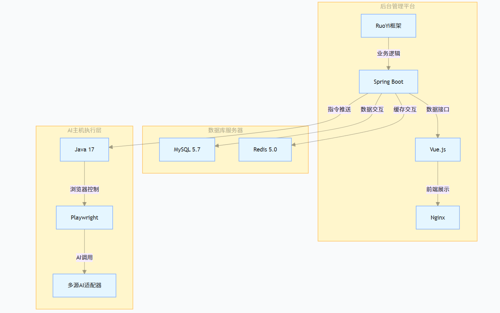
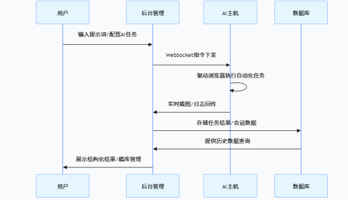

<p align="center">    </p>

# U3W 优立方 AI 主机：人机协同数智驱动的团队未来

版本：2.10B

文档更新日期：2025年7月31日

## 重要提醒

近日将进行较大幅度版本更新，会涉及部分AI的变动，请注意及时更新代码。

## 代码更新日志

- 2025-07-30：千问AI上架
- 2025-07-29：“投递到公众号”模块升级为“投递到媒体”;目前的可投递媒体包括公众号和知乎、微头条。
- 2025-07-20：MiniMax AI上架


## 目录

- [1. 部署文档](#1-项目结构)
- [2. 概述](#2-概述)
- [3. 优立方：品牌理念与核心价值](#3-优立方品牌理念与核心价值)
- [4. 产品与市场定位](#4-产品家族与市场定位)
- [5. 系统架构与技术实现](#5-系统架构与技术实现)
- [6. 常见问题](#6-常见问题)

## 1. 项目结构

```
U3W-AI/
├── common_deployment_guide.md  [公共环境部署指南](common_deployment_guide.md)
├── cube-mini/            # 优立方AI主机控制台小程序端
│   └── deployment_guide.md  [部署指南](cube-mini/deployment_guide.md)
├── cube-admin/           # 优立方AI主机控制台后端
│   └── deployment_guide.md  [部署指南](cube-admin/deployment_guide.md)
├── cube-ui/              # 优立方AI主机控制台前端
│   └── deployment_guide.md  [部署指南](cube-ui/deployment_guide.md)
├── cube-engine/          # 优立方AI主机核心服务
│   └── deployment_guide.md  [部署指南](cube-engine/deployment_guide.md)
├── cube-common/          # 公共工具模块
├── cube-framework/       # 框架核心模块
├── sql/                  # 数据库脚本
└── README.md             # 项目说明文档
```
### 1.1 部署文档
公共环境部署指南：[点击前往](common_deployment_guide.md)

优立方AI主机核心服务：[点击前往](cube-engine/deployment_guide.md)

优立方AI主机控制台后端：[点击前往](cube-admin/deployment_guide.md)

优立方AI主机控制台前端：[点击前往](cube-ui/deployment_guide.md)

优立方AI主机控制台小程序端：[点击前往](cube-mini/deployment_guide.md)


<a href="#u3w-优立方-ai-主机人机协同数智驱动的团队未来">返回顶部 ↑</a>

## 2、概述

与需要依赖官方API接口、需要向AI厂商支付API调用费用和Token费用的AI集成框架不同，U3W优立方AI主机的目标，是让大部分团队型创业者甚至中小企业，都有自己用得起的、与AI发展随时同步的AI主机，这一点，随着对于U3W优立方AI主机的了解和深入应用，再比较使用传统模式的AI主机和AI应用模式，用户会日益有感。

U3W优立方AI主机的系统结构以 “模块化、分布式、高协同” 为核心，通过分层设计实现 “业务逻辑 - 任务执行 - 用户交互” 的解耦，同时依托 Java、Vue.js、Playwright 等技术栈确保高性能与稳定性。这种结构既满足团队协作的数字化需求，又通过多 AI 集成与自动化执行支撑智能内容创作，最终实现 “团队智慧 + AI 智慧 + 商业智慧” 的三重价值融合。

<a href="#u3w-优立方-ai-主机人机协同数智驱动的团队未来">返回顶部 ↑</a>

## 3. 优立方：品牌理念与核心价值

品牌名称：U3W 优立方

Slogan：Unique³ Wisdom（独特智慧三次方）

### 3.1 品牌理念：Unique³ Wisdom

“Unique³ Wisdom” 代表了优立方平台的三重智慧融合：

#### 3.1.1 团队智慧 (Team Wisdom)

平台构建的协作化工作流引擎，支持多成员协同创作，实现团队能力的数字化聚合。通过稿库管理、历史会话共享、多版本对比等功能，将分散的个体能力转化为结构化的团队资产，显著提升组织协同效率。

#### 3.1.2 AI 智慧 (AI Wisdom)

平台深度集成并不断扩展 AI 能力（如深度思考、联网搜索），赋予机器智能决策和内容生成的能力。通过DeepSeek、豆包等多源 AI 账号聚合，实现 “提示词→智能生成→内容优化+评分整合+分享复用” 的闭环，让 AI 成为团队创意的智能引擎。

#### 3.1.3 商业智慧 (Business Wisdom)

平台通过将 AI 能力与团队协作模式深度应用于实际商业场景（如内容营销、数据洞察、知识服务、创意策划等），帮助企业提升效率、降低成本、优化决策，最终实现商业价值的增长。依托自动化内容分发、多平台适配等功能，将团队创作成果高效转化为商业产出。

### 3.2 核心价值主张

* **极致效率**：通过团队协作流程数字化，减少重复沟通成本，加速内容生产和业务流程。
* **智能赋能**：融合前沿 AI 技术，为团队提供智能内容创作、分析和优化能力，提升创意产出质量。
* **灵活定制**：模块化架构支持按需部署与深度集成，满足企业个性化团队协作需求。
* **可见可控**：实时可视化监控任务执行与协作进度，确保团队流程透明可控。
* **数据资产化**：系统化管理团队生成内容与协作数据，形成可复用的企业知识资产。

<a href="#u3w-优立方-ai-主机人机协同数智驱动的团队未来">返回顶部 ↑</a>

## 4. 典型应用场景与开源项目目标市场


#### 4.1 典型应用场景

U3W优立方 AI 主机有丰富的应用场景。当前典型应用场景是，AI 驱动的智能内容创作与团队管理一体化平台。特点是，以一个开源项目平台，实现多主机接入、多AI上架、多账号共享、多环节创意和多渠道发布。

#### 4.2 开源项目目标市场

个人开发者、开源贡献者、技术爱好者、非商业项目、高校科研机构。

#### 4.3 核心功能

基于 Java 和 Playwright 的浏览器自动化控制核心，支持团队协作基础能力：

##### 4.3.1 一问多答功能

支持用户扫码授权后，将DeepSeek、豆包等原生AI 等各类AI 账号的使用权配置给主机使用。当用户配置完成后，主机代理用户访问这些 AI 账号，用户只需输入一次提示词，主机即分别向 AI 转发这些提问，并获取 AI 的回答，供团队成员共享使用。

##### 4.3.2 多 AI 账号扩展

后续将陆续支持集成更多的 AI 账号，为团队提供多元化智能能力支持。

##### 4.3.3 标准化接口

提供标准化的 REST API 接口，用于驱动浏览器执行任务并返回结构化数据，方便团队进行二次开发与系统集成。

##### 4.3.4 多样化的使用场景

支持从浏览器端、小程序端、企业微信工作台使用核心功能，支持微信及企业微信登录。

##### 4.3.5 执行过程可视化

支持执行过程截图的本地化存储，便于团队成员追溯任务执行细节。

##### 4.3.6 结果结构化输出

返回最终任务结果（当前支持 Markdown，部分AI支持 HTML 片段），满足团队内容创作的标准化需求。支持结果以文本、MD、图片等多种形式展示、输出。支持将结果直接投递到公众号、知乎、微头条等媒体，支持在投递到媒体前以AI提示词对内容进行智能排版。

##### 4.3.7 单台主机可同时运行多个优立方账号

每个优立方账号均可以绑定它自己的多组AI账号，同时，每台主机都支持多个优立方账号同时运行。每个优立方后台管理系统均支持多台AI主机同时接入。

##### 4.3.8 支持区块链积分系统，便于数据资产治理及运营

基于区块链生成系统积分，支持通过管理员后台基于积分规则进行积分运营，为内容资产上链和社区贡献记账、数据追溯等建立治理基础。

#### 4.4 授权模式

实行双许可证模式：

##### 4.4.1 开源许可证

面向个人开发者和非商业用途，允许自由使用、修改和分发核心代码，不收取任何费用。

##### 4.4.2 商业许可证

当企业需要将其集成到商业产品或服务中时，需通过购买优立方 AI 主机企业版获得商业授权。商业许可证的主要目标群体是各行各业需要提升内容生产效率、实现团队协作自动化的企业、机构及商业用户。


<a href="#u3w-优立方-ai-主机人机协同数智驱动的团队未来">返回顶部 ↑</a>

## 5. 系统架构与技术实现

优立方 AI 主机采用先进的模块化、分布式架构，确保高效率、高稳定性和易于扩展性。




### 5.1 整体架构概览

优立方 AI 主机主要由以下三大核心组件构成，它们分别部署在不同的环境中，实现功能解耦和高性能协作：

#### 5.1.1 后台管理平台及数据库服务器

系统的 “大脑”，负责业务逻辑、数据处理和用户交互，支持团队协作流程的数字化管理。

#### 5.1.2 小程序控制端及PC控制端

PC控制端支持用户通过浏览器进行系统管理；小程序控制端适合用户在微信和企业微信上进行常用AI操作。


#### 5.1.3 优立方 AI 主机

系统的 “执行者”，负责核心的 AI 驱动浏览器自动化任务，支持团队任务的自动化执行与结果回传。

### 5.2 核心组件技术栈与部署

| 模块名称           | 核心技术栈                                      | 部署环境       | 核心职责                                                                                       |
|------------------|-----------------------------------------------|--------------|--------------------------------------------------------------------------------------------|
| 后台管理平台         | 若依（RuoYi）框架、Java 17（Spring Boot）、Vue.js、Nginx | Linux 服务器   | 处理业务逻辑、用户权限控制、指令分发；通过 WebSocket 与 AI 主机实时通信；管理团队协作流程。          |
| 数据库服务器         | MySQL 5.7（utf8mb4）、Redis 6.x               | Linux 服务器   | 存储任务结果、执行日志、历史会话等数据；Redis 负责实时会话缓存与状态管理，支持团队数据资产化。      |
| 优立方 AI 主机执行层 | Java 17、Playwright                           | Windows 主机  | 驱动浏览器自动化执行 AI 任务（如调用DeepSeek、豆包等 AI 模型）；实时回传执行截图与日志；支持多账号并行运行。 |
| 前端交互层（cube-ui） | Vue.js、Nginx                                 | Linux 服务器   | 提供 Web 端控制台界面，支持提示词输入、AI 模型选择、结果可视化（Markdown 渲染）与稿库管理。            |
| 小程序控制端（cube-mini） | 微信 / 企业微信小程序框架                      | 小程序平台     | 支持移动端快速操作，如常用 AI 任务配置、执行状态查看，适配企业微信免登录场景。                     |

### 5.3 模块间协作与数据流




优立方 AI 主机各模块之间通过标准化的通信协议和接口紧密协作，形成高效的数据流闭环：

#### 5.3.1 用户指令发起

用户通过后台管理平台的用户界面或小程序控制端，输入指令或配置 AI 任务（如提示词、AI 模型选择），支持团队成员协同输入与任务规划。

#### 5.3.2 指令下发

后台管理平台将指令通过 WebSocket 推送至优立方 AI 主机，支持团队任务的批量分发与进度跟踪。

#### 5.3.3 智能任务执行

优立方 AI 主机接收指令并驱动浏览器执行自动化任务。在此过程中，调用集成的各种 AI 服务进行深度思考、联网搜索或内容生成，满足团队智能化协作需求。

#### 5.3.4 实时反馈与结果回传

任务执行过程中的实时日志和浏览器截图通过 WebSocket 持续回传至后台管理平台，供团队成员实时监控。最终任务执行结果（如 Markdown 格式的内容、HTML 片段、结构化数据）也通过 WebSocket 或 REST API 回传，实现团队信息同步。

#### 5.3.5 数据存储与管理

后台管理平台接收到的任务结果、执行日志、历史会话以及用户相关数据等，均存储至 MySQL 数据库。Redis 则用于高效管理实时会话状态和提供数据缓存，支持团队数据资产的系统化管理。

#### 5.3.6 结果展示与内容管理

后台管理平台将存储的数据进行可视化展示（如 Markdown 渲染），并提供稿库管理、历史会话查询、智能评分等功能，形成完整的团队交互和内容资产管理闭环。支持用户将结果直接投递到绑定的媒体上。

## 6. 常见问题
- [微信小程序登录相关问题](常见问题文档/微信小程序登录相关问题.md)
- [稿库报错相关问题](常见问题文档/稿库报错相关问题.md)
